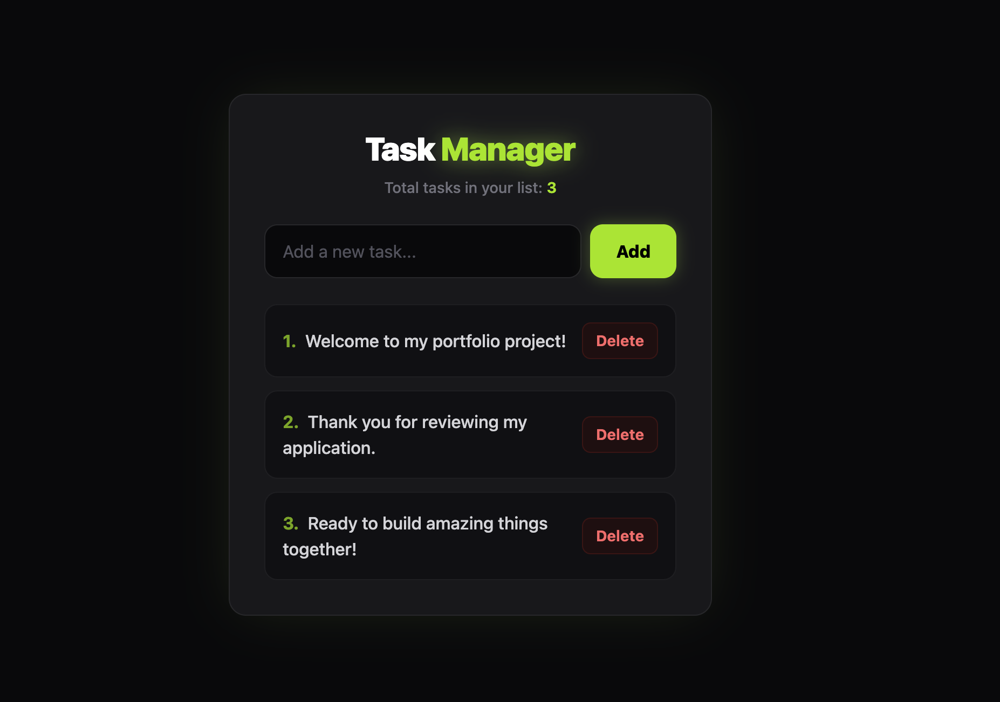

# 🌌 Neon Task Manager



A modern, high-performance task management application built to demonstrate core frontend development proficiencies. Features a custom cyberpunk-inspired dark theme with neon accents and robust data persistence.

🟢 **[Open Live Demo](https://siuzannavach.github.io/todo-app/)**

---

## ✨ Key Features

- **Dynamic List Rendering** — efficient state management using React hooks.
- **Data Persistence** — automatic synchronization with browser `LocalStorage` to retain tasks across sessions.
- **Responsive Cyberpunk UI** — built with **Tailwind CSS v4**, custom glow effects, and sleek micro-interactions.
- **Semantic Code Architecture** — clean HTML5 structure (`<ul>`/`<li>`) optimized for web accessibility (a11y).

## 🛠️ Tech Stack

- **Frontend Framework:** React 19 (TypeScript)
- **Build Tool:** Vite
- **Styling:** Tailwind CSS v4
- **Linting:** ESLint
- **Version Control:** Git Flow (`main` / `dev` branching)

## 🚀 Getting Started

### Prerequisites

Make sure you have [Node.js](https://nodejs.org) (v18 or later) installed on your machine.

### Installation

1. **Clone the repository:**
   ```bash
   git clone https://github.com/SiuzannaVach/todo-app.git
   ```

2. **Navigate into the project directory:**
   ```bash
   cd todo-app
   ```

3. **Install dependencies:**
   ```bash
   npm install
   ```

4. **Run the development server:**
   ```bash
   npm run dev
   ```
   The app will be available at `http://localhost:5173`.

### Available Scripts

| Command           | Description                              |
|-------------------|-------------------------------------------|
| `npm run dev`     | Starts the local development server.       |
| `npm run build`   | Type-checks and builds the app for production. |
| `npm run preview` | Serves the production build locally.       |
| `npm run lint`    | Runs ESLint across the project.            |

## 📁 Project Structure

```text
├── public/            # Static assets
├── src/
│   ├── assets/         # Images and icons
│   ├── App.tsx         # Root application component
│   ├── App.css         # Component-level styles
│   ├── index.css        # Global styles (Tailwind entry)
│   └── main.tsx         # Application entry point
├── index.html          # HTML shell
├── package.json        # Project dependencies and scripts
├── tailwind.config.js   # Tailwind CSS configuration
├── tsconfig.json        # TypeScript configuration
└── vite.config.ts       # Vite configuration
```

## 📝 License

Distributed under the MIT License. See `LICENSE` for more information.

---
*Created with ❤️ by [SiuzannaVach](https://github.com/SiuzannaVach)*
